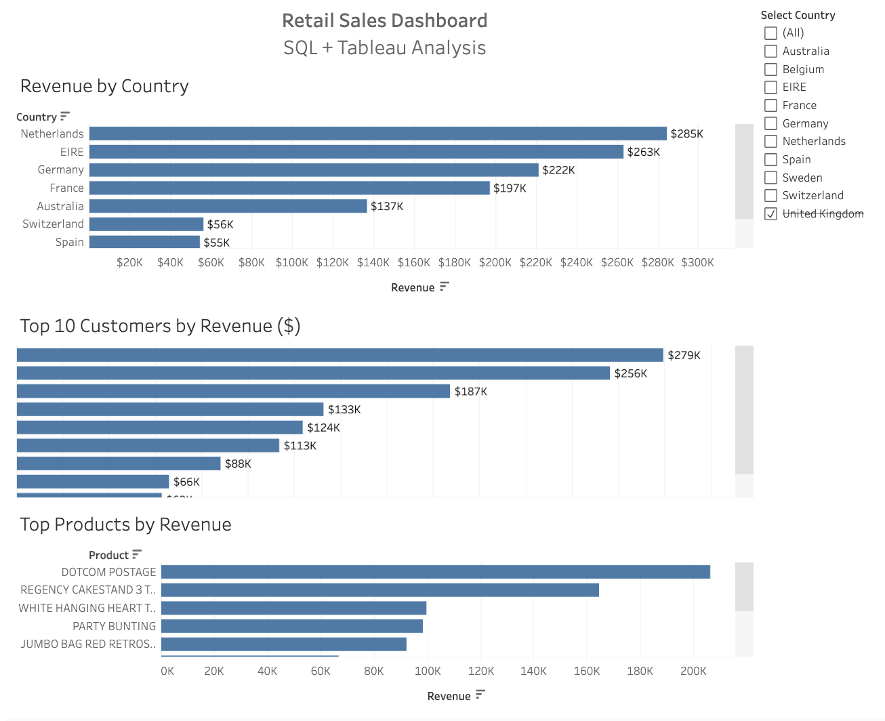

📊 Retail Sales Dashboard

SQL + Tableau Analysis

---

📌 Overview

This project presents a Tableau dashboard built from retail sales data analyzed using SQL. It highlights revenue trends across countries, customers, and products to uncover key business insights and support data-driven decision-making.

---

🛠️ Tools Used

- SQL
- Tableau
- Excel (data preparation)

---

🌐 Live Dashboard

👉 [View on Tableau Public](https://public.tableau.com/app/profile/reveng.sairany/viz/RetailSalesDashboardSQLTableauAnalysis/Dashboard1)

---

📸 Dashboard Preview

---

🔍 Key Insights

- Netherlands and EIRE generate the highest revenue across all countries
- A small group of customers contributes a large portion of total sales
- Top-performing products significantly drive overall revenue
- Revenue distribution shows clear opportunities for targeted growth strategies

---

📁 Project Structure

- "dashboard.png" — Screenshot of Tableau dashboard
- "README.md" — Project documentation

---

📝 Notes

Data was analyzed using SQL in a separate project.
👉 [SQL Analysis Repo](https://github.com/revengsairany-bot/sql-retail-sales-analysis)
